# Diamonds_Henrique


## Project objective


This project is based on a [somewhat classic kaggle dataset from 2016](https://www.kaggle.com/datasets/shivam2503/diamonds) used to explain introductory level machine learning.
Given a historic dataset with over 54,000 diamonds prices (`diamonds.csv`) and their characteristics, we are tasked by our client (Rick Harrison from _Pawn Stars_) to estimate the price of his own list (`rick_diamonds.csv`)
of 5,000 diamonds, thus setting up a classic regression problem. Specificaly, the goals are:


- to infer which characteristics are more likely to influence a diamond's price
- to progressively train and test a regression model until its accuracy meet a certain standard (defined by the RMSE). Rick’s goal is to obtain an average error below 900 dollars.

<p align="center"></p>

---

## Technologies
- Python 3.8.3
	- Pandas 1.4.4
	- Numpy 1.20.3
	- Pycaret 2.3.10
	- Seaborn 0.11.2
	- Matplotlib 3.5.3
	- SQLAlchemy 1.4.42
	- Scikit-learn 1.1

---

## Dataset Description and Inspection:

The list of diamonds contains the following information:

- carat (0.2-5.01): The carat is the diamond’s physical weight measured in metric carats. One carat equals 0.20 gram and is subdivided into 100 points.
- cut (Fair, Good, Very Good, Premium, Ideal): The quality of the cut. The more precise the diamond is cut, the more captivating the diamond is to the eye thus of high grade.
- color (from J (worst) to D (best)): The colour of gem-quality diamonds occurs in many hues. In the range from colourless to light yellow or light brown. Colourless diamonds are the rarest. Other natural colours (blue, red, pink for example) are known as "fancy,” and their colour grading is different than from white colorless diamonds.
- clarity (I1 (worst), SI2, SI1, VS2, VS1, VVS2, VVS1, IF (best)): Diamonds can have internal characteristics known as inclusions or external characteristics known as blemishes. Diamonds without inclusions or blemishes are rare; however, most characteristics can only be seen with magnification.
- depth (43-79): It is the total depth percentage which equals to z / mean(x, y) = 2 * z / (x + y). The depth of the diamond is its height (in millimetres) measured from the culet (bottom tip) to the table (flat, top surface) as referred in the labelled diagram above.
- table (43-95): It is the width of the top of the diamond relative to widest point. It gives diamond stunning fire and brilliance by reflecting lights to all directions which when seen by an observer, seems lustrous.
- price ($326 - $18826): It is the price of the diamond in US dollars. It is our very target column in the dataset.
- x (0 - 10.74): Length of the diamond (in mm)
- y (0 - 58.9): Width of the diamond (in mm)
- z (0 - 31.8): Depth of the diamond (in mm)

<p align="center"></p>

- The dataset itself doesn't need any cleaning other than the removal of a few lines where dimensions (y or x) are set to zero, which is physically impossible.
- diamonds.describe yields an univariate analysis for statistical description:

|       |        carat |        depth |        table |        price |            x |            y |            z |
|------:|-------------:|-------------:|-------------:|-------------:|-------------:|-------------:|-------------:|
| count | 48940.000000 | 48940.000000 | 48940.000000 | 48940.000000 | 48940.000000 | 48940.000000 | 48940.000000 |
|  mean |     0.797817 |    61.751931 |    57.451161 |  3934.409644 |     5.730712 |     5.734333 |     3.538648 |
|   std |     0.474126 |     1.430026 |     2.233450 |  3989.333861 |     1.121920 |     1.145344 |     0.706817 |
|   min |     0.200000 |    43.000000 |    43.000000 |   326.000000 |     0.000000 |     0.000000 |     0.000000 |
|   25% |     0.400000 |    61.000000 |    56.000000 |   949.000000 |     4.710000 |     4.720000 |     2.910000 |
|   50% |     0.700000 |    61.800000 |    57.000000 |  2401.000000 |     5.690000 |     5.710000 |     3.520000 |
|   75% |     1.040000 |    62.500000 |    59.000000 |  5331.250000 |     6.540000 |     6.540000 |     4.040000 |
|   max |     5.010000 |    79.000000 |    95.000000 | 18823.000000 |    10.740000 |    58.900000 |    31.800000 |

---

## Exploring each of the attributes:

### Price

- "Price", as expected, is skewed. There are few diamonds which are worth too much and a lot of diamonds with reasonably small prices.

<p align="center"></p>

---

### Cuts

- Most of the diamonds have **Ideal Cuts** with a ratio of **39.95%** followed by **Premium Cuts** and **Very Good Cuts**
<p align="center"></p>

-In absolute values, we get:

<p align="center"></p>

#### Price distribution of diamond cuts:

<p align="center"></p>

- Most of the diamonds with **Ideal Cut** costs between **$326** and **$2500**
- Most of the diamonds with **Premium Cut** costs between **$326** and **$5000**
- Most of the diamonds with **Very Good Cut** costs between **$336** and **$4800**
- Most of the diamonds with **Good Cut** costs between **$327** and **$4700**
- Most of the diamonds with **Fair Cut** costs between **$337** and **$5000**

---

### Colors

- Most of the diamonds have **G** color with a ratio of **20.93%** followed by **E** and **F**
- Only a few have **J** (worst) color with a ratio of **5.21%**.

<p align="center"></p>

-In absolute values, we get:

<p align="center"></p>

#### Price distribution of diamond colors:

<p align="center"></p>

**Insights:**

- Most of the diamonds with **G Color** costs between **$354** and **$2500**
- Most of the diamonds with **E Color** costs between **$326** and **$3700**
- Most of the diamonds with **F Color** costs between **$342** and **$4500**
- Most of the diamonds with **H Color** costs between **$337** and **$5200**
- Most of the diamonds with **D Color** costs between **$357** and **$2500**
- Most of the diamonds with **I Color** costs between **$334** and **$6200**
- Most of the diamonds with **J Color** costs between **$335** and **$6400**

---

### Clarity

- Most of the diamonds have **SI1** clarity with a ratio of **24.22%** followed by **VS2** and **SI2**
- Only a few have **I1** clarity with a ratio of **1.37%**.

<p align="center"></p>

- In absolute values, we get:

<p align="center"></p>

#### Price distribution of diamond clarities:

<p align="center"></p>

**Insights:**

- Most of the diamonds with **SI1 Clarity** costs in between **$326** and **$5100**
- Most of the diamonds with **VS2 Clarity** costs in between **$334** and **$2600**
- Most of the diamonds with **SI2 Clarity** costs in between **$326** and **$5200**
- Most of the diamonds with **VS1 Clarity** costs in between **$327** and **$3600**
- Most of the diamonds with **VVS2 Clarity** costs in between **$336** and **$3500**
- Most of the diamonds with **VVS1 Clarity** costs in between **$336** and **$3000**
- Most of the diamonds with **IF Clarity** costs in between **$369** and **$2500**
- Most of the diamonds with **I1 Clarity** costs in between **$345** and **$7500**

---

### Weights

- The weight distribution is skewed. They mostly fall between **0.2 carat** and **1.2 carat**. 

<p align="center">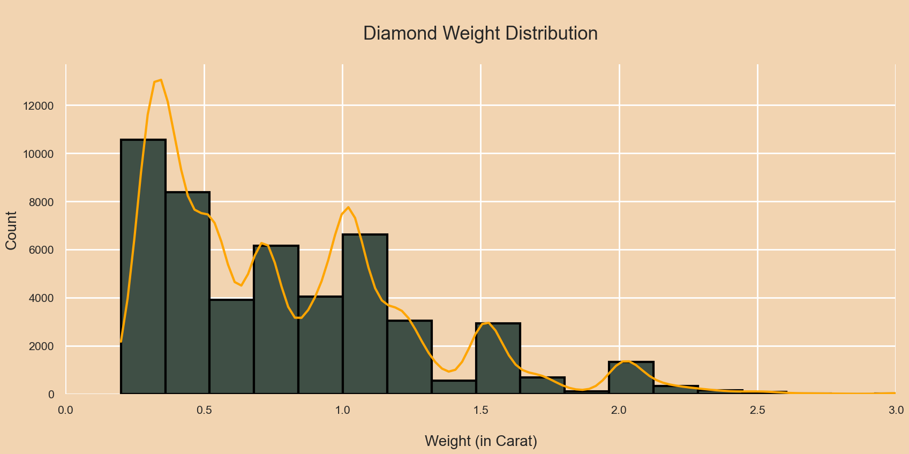</p>

#### Price distribution of diamond weights:

<p align="center">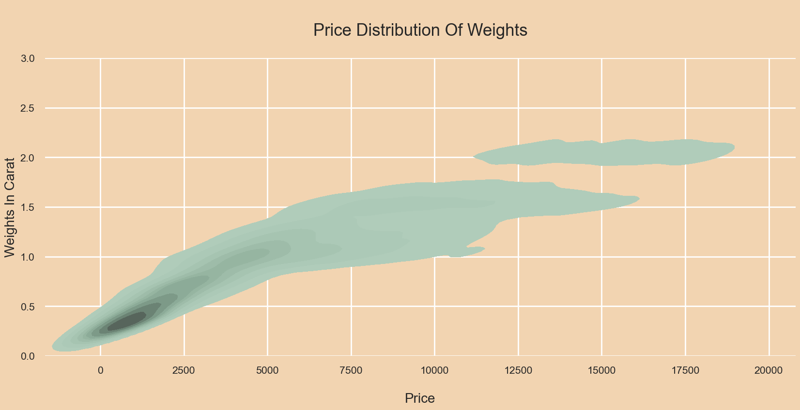</p>

- The majority costs between **$326** and **$5000**.
- Interestingly enough, KDE plots really do extrapolate values to ranges that may not make any sense (as is the case of diamonds with negative values).
- Please bear in mind that I'm just testing and exploring a couple of different graphs!

---

### Diamond Depth Percentage

- We can see that the depth percentage distribution is normally distributed. Most diamonds fall between values of **60%** and**64%**.

<p align="center">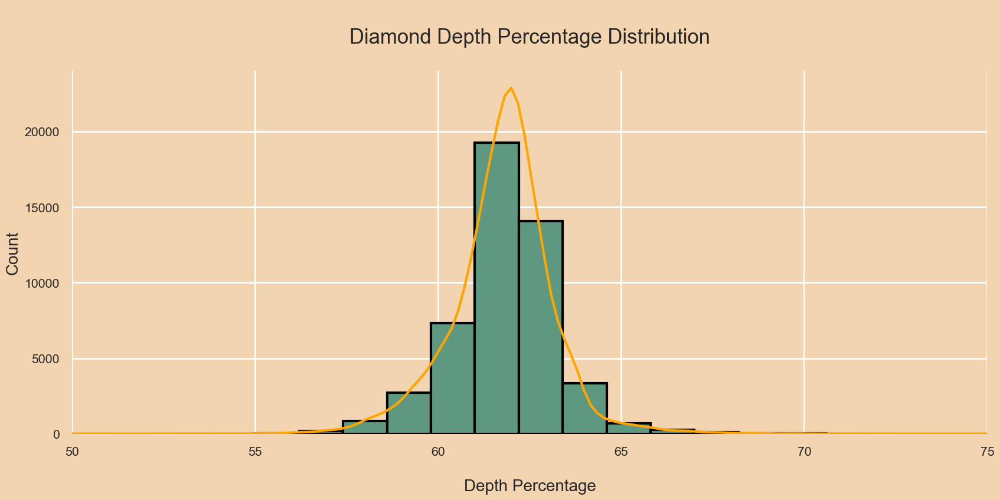</p>

#### Price distribution of depth percentage:

<p align="center">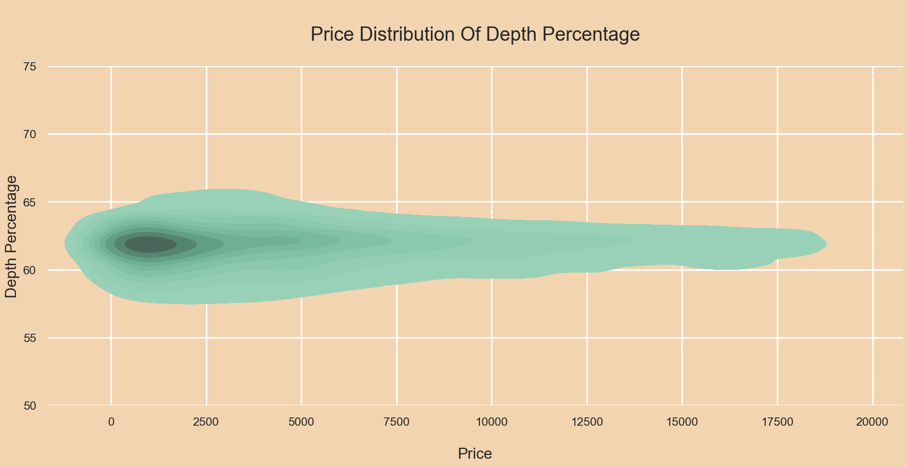</p>

- Most costs fall between **$326** and **$6200**.

---

### Diamond Tables

- Most of diamond tables fall between **54** and **61**.

<p align="center">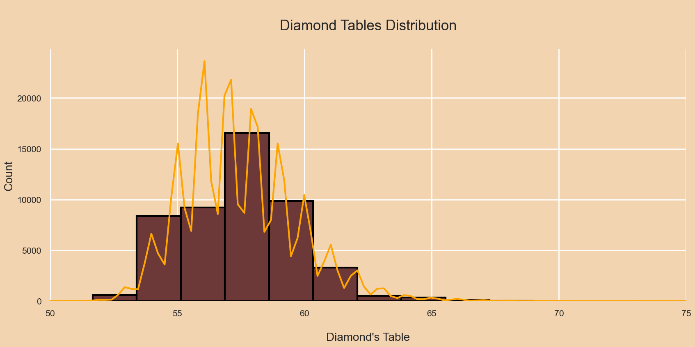</p>

#### Price distribution of tables:

- The majority costs between **$326** and **$3800**.

<p align="center">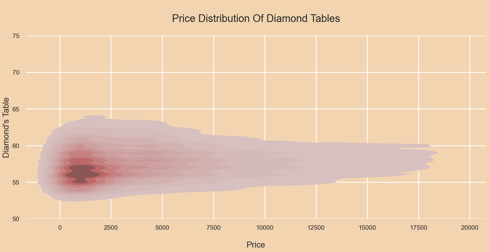</p>

- The table is measured as the width of the top of the diamond relative to the widest point, and it's an artificial feature imposed by the artisan, which explains the
"sawed" distribution seen in both graphs above, as certain ratios are prefered when cutting and shaping the diamonds.

---

## Data Cleaning

- The pairplot immediately tells us that there are some features with datapoints that are far from the rest of its colleagues. This will affect the outcome of our regression model and hence they will be removed.

<p align="center"></p>

- Let's examine the regression lines in these distributions as well.

<p align="center">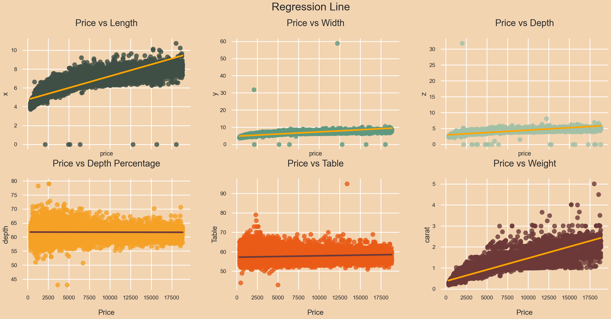</p>

- After dropping the outliers, let's have a look at the new pairwise relationships:

<p align="center">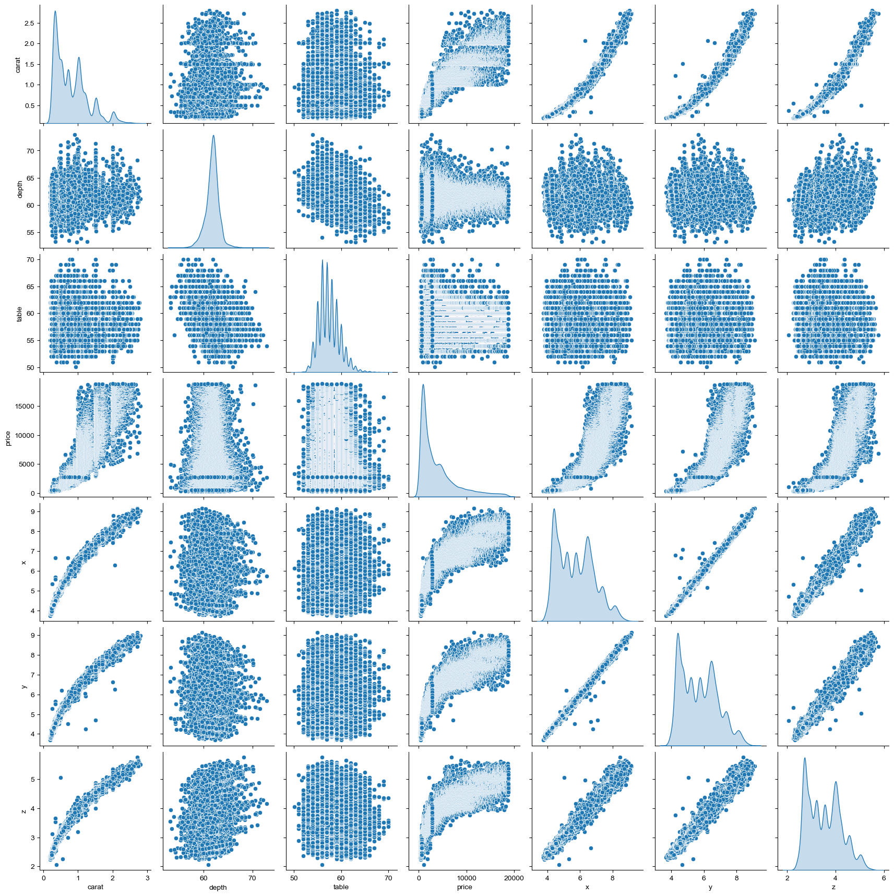</p>

---

## Bivariate Analysis:

- Let's analyze the correlation matrix between the variables:

<p align="center">

|       |    carat |     depth |     table |     price |         x |         y |        z |
|------:|---------:|----------:|----------:|----------:|----------:|----------:|---------:|
| carat | 1.000000 |  0.027074 |  0.181688 |  0.922186 |  0.975152 |  0.949687 | 0.951824 |
| depth | 0.027074 |  1.000000 | -0.297123 | -0.012037 | -0.025858 | -0.029903 | 0.094344 |
| table | 0.181688 | -0.297123 |  1.000000 |  0.127832 |  0.195367 |  0.183362 | 0.150646 |
| price | 0.922186 | -0.012037 |  0.127832 |  1.000000 |  0.885019 |  0.864059 | 0.860247 |
|     x | 0.975152 | -0.025858 |  0.195367 |  0.885019 |  1.000000 |  0.972447 | 0.969336 |
|     y | 0.949687 | -0.029903 |  0.183362 |  0.864059 |  0.972447 |  1.000000 | 0.948768 |
|     z | 0.951824 |  0.094344 |  0.150646 |  0.860247 |  0.969336 |  0.948768 | 1.000000 |

</p>

Which can also be visualized as a heatmap of correlations:

<p align="center">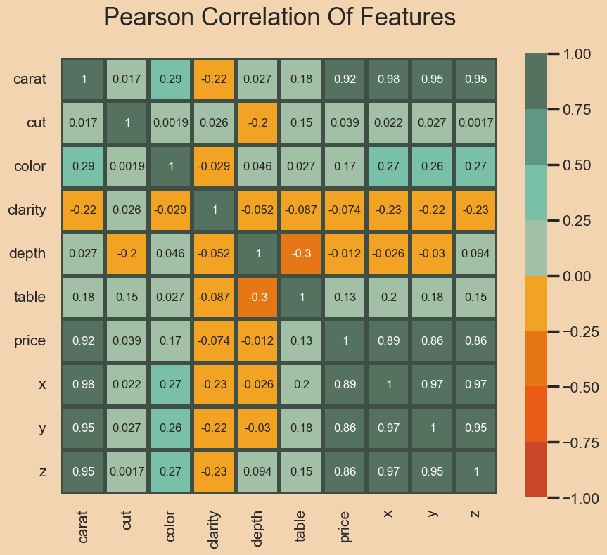</p>

The price of a diamond has a direct correlation with its dimensions (and hence with the carat, since the weight of the diamonds is itself a function of its dimensions). It is not a straight linear correlation but an exponential one.
There are other relevant features which also influence its price, such as color, clarity and cut.

---

## A Further Look

### Let's now look at how this diagram varies by associating other features

- Correlation 'price' and 'carat' associated to 'color'

<p align="center">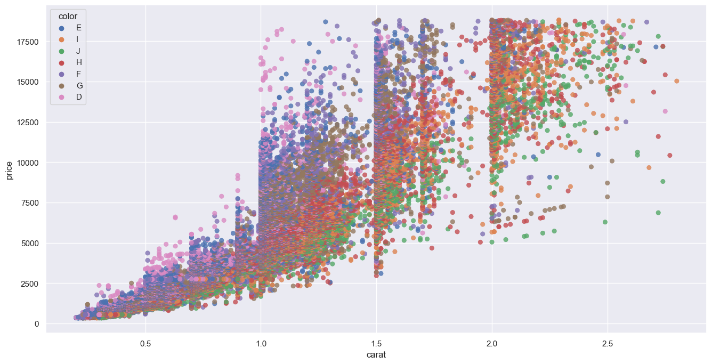</p>

- Correlation 'price' and 'carat' associated to 'clarity'

<p align="center">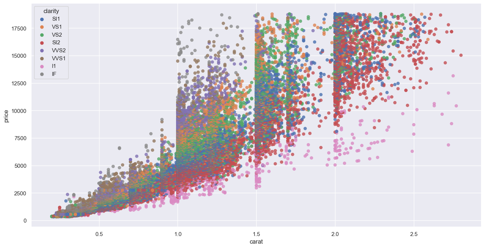</p>

- Correlation 'price' and 'carat' associated to 'cut'

<p align="center">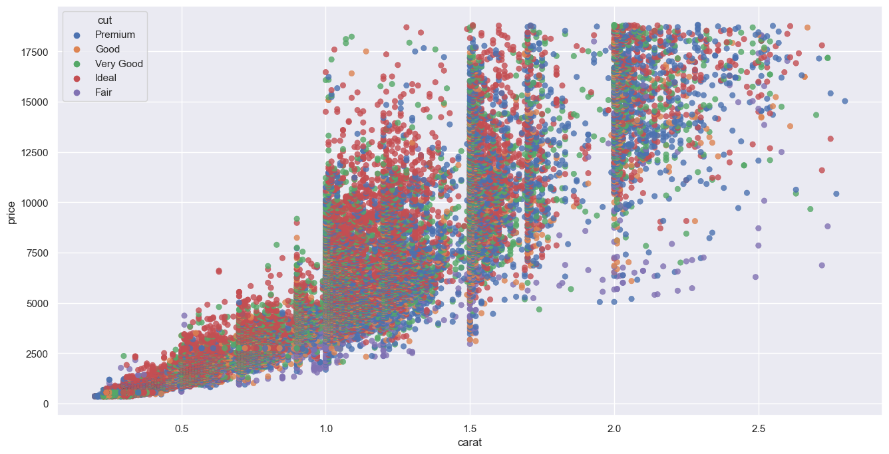</p>

Since the first plot clearly points to a logarithmic relation between price and carat, we will perform a log transformation so that the additional relations become clearer:

```
	diamonds["carat_log"] = np.log(diamonds["carat"])
	diamonds["price_log"] = np.log(diamonds["price"])
```

- Correlation 'price_log' and 'carat_log' associated to 'color'

<p align="center">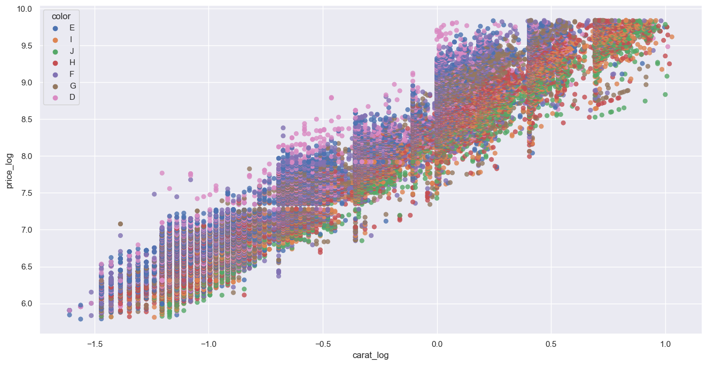</p>

- Correlation 'price_log' and 'carat_log' associated to 'clarity'

<p align="center">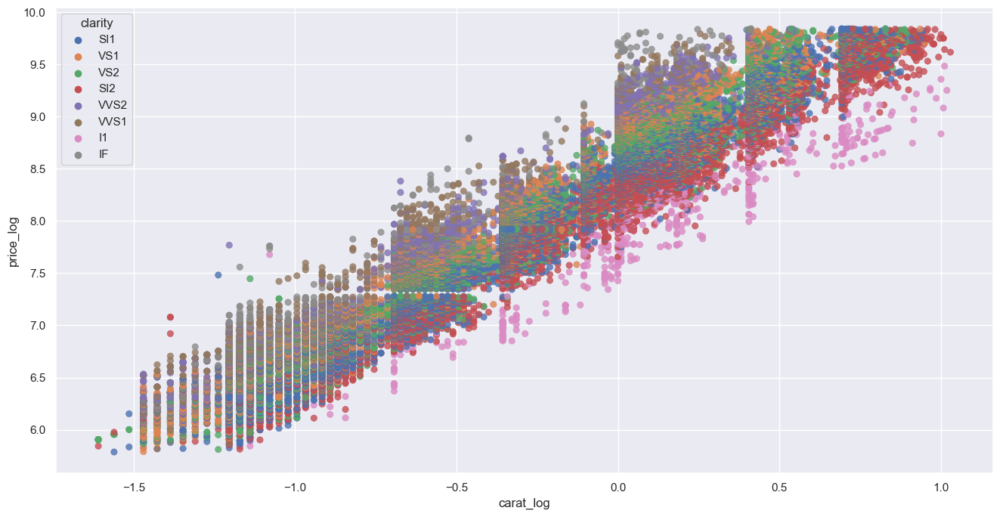</p>

- Correlation 'price_log' and 'carat_log' associated to 'cut'

<p align="center">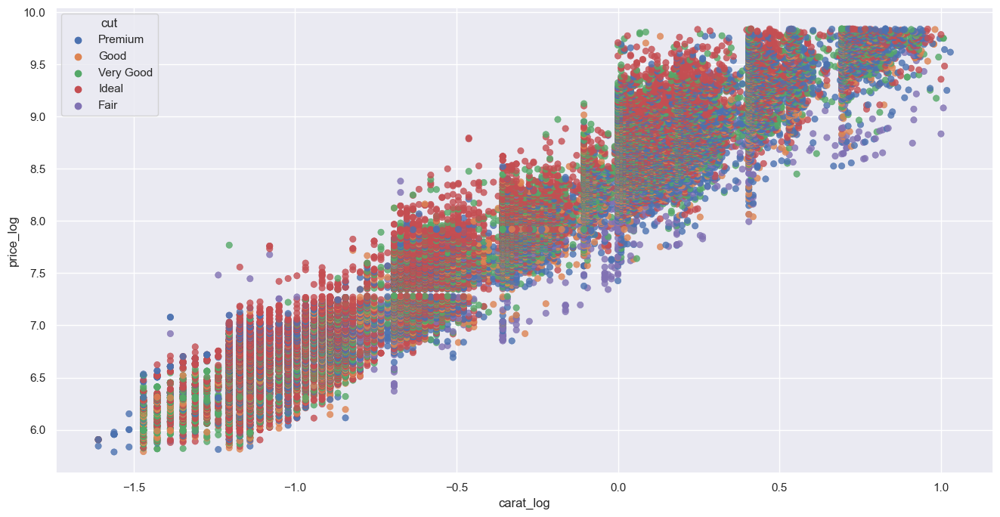</p>

---

## Model Creation & Performance Evaluation

- We will first standardize the data and then split the dataset with a ratio of 0.2 i.e. 80% of data will be used for training and 20% for the validation process:

```
	sc = StandardScaler()
	x = diamonds.drop(["price"],axis =1) # price will be our target (y)
	x = sc.fit_transform(x)
	y = diamonds["price"]
	x_train, x_test, y_train, y_test = train_test_split(x, y, test_size=0.2, random_state=42)
```

- With the pre-processing done, let's try a couple of different predictive models with SKLearn and compare their respective RMSE's (ideally, this comparison would be much faster with PyCaret, but let's stick with a manual implementation for now, for didactic purposes):

### Linear Regression

```
	lr = LinearRegression()
	lr.fit(x_train,y_train)
	y_pred = lr.predict(x_test)
```

- After performing the Linear Regression with SKLearn, we get:

```
	R Squared Value: 0.8885407086951569
	Adjusted R Squared Value: 0.8884381178154531
	Mean Absolute Error: 844.8370225588242
	Mean Squared Error: 1733016.3581049452
	Root Mean Squared Error: 1316.4407917202145
```

### Decision Tree Regression

```
	dt = DecisionTreeRegressor()
	dt.fit(x_train,y_train)
	y_pred = dt.predict(x_test)
```

- After performing the Decision Tree Regression with SKLearn, we get:

```
	R Squared Value: 0.9640975493985238
	Adjusted R Squared Value: 0.9640645035757162
	Mean Absolute Error: 364.3079280751941
	Mean Squared Error: 558226.5368818962
	Root Mean Squared Error: 747.1455928277273
```

### Random Forest Regression

```
	rf = RandomForestRegressor()
	rf.fit(x_train,y_train)
	y_pred = rf.predict(x_test)
```

- After performing the Random Forest Regression with SKLearn, we get:

```
	R Squared Value: 0.9805862653291031
	Adjusted R Squared Value: 0.9805683962748959
	Mean Absolute Error: 269.82116456983283
	Mean Squared Error: 301852.9847328354
	Root Mean Squared Error: 549.4114894437823
```

### K-Neighbours Regression

```	
	kn = KNeighborsRegressor()
	kn.fit(x_train,y_train)
	y_pred = kn.predict(x_test)
```

- After performing the K-Neighbours Regression with SKLearn, we get:

```
	R Squared Value: 0.9599407056786297
	Adjusted R Squared Value: 0.9599038337570821
	Mean Absolute Error: 402.15884756845116
	Mean Squared Error: 622858.906963629
	Root Mean Squared Error: 789.2141071747444
```


---

## Steps

1 - Price predicted as the mean of prices from `diamonds.csv`(3980)


2 - Price predicted using carat as the only variable from `diamonds.csv`(1605)


3 - Price predicted using carat and depth variables from `diamonds.csv`(1598)


4 - Price predicted using carat and table variables from `diamonds.csv`(1595)


5 - Price predicted using carat, table and depth variables from `diamonds.csv`(1583)


6 - Price predicted using carat, table, depth and clarity variables from `diamonds.csv`(1217); Cut does not seen to influence the model


7 - Price predicted using carat, table, depth, clarity and color variables from `diamonds.csv`(987); Cut does not seen to influence the model


8 - Price predicted using carat,table,depth,x, clarity and color variables `from diamonds.csv(709)`; Cut does not seen to influence the model


X was the missing piece in this linear regression model


9 - Price predicted using carat,table,depth,x, clarity , color and cut(grouped by Fair and Good) variables from diamonds.csv(688)

---

# Conclusion
Using most of the data of the original DataFrame significantly improved the preciseness of the model.